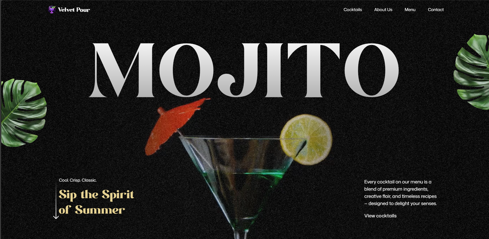

# 🍹 GSAP Cocktail Website

A **stunning, scroll-driven cocktail website** built with **React, Tailwind CSS, and GSAP**.  
This project delivers a cinematic, interactive web experience with advanced **scroll-triggered animations**, **SplitText reveals**, **parallax effects**, and a fully responsive UI.  

---

## 🚀 Features

### 🎬 Animations & Interactions
- **SplitText Animations** → Impactful text reveals for headings and intros  
- **ScrollTrigger Effects** → Scroll-driven animations with timeline control  
- **Parallax Scrolling** → Immersive depth that reacts to user scroll  
- **Pinned Sections** → Lock sections while animating content for smooth storytelling  
- **Scroll-Synced Video Playback** → Control video progress with scroll for cinematic experiences  
- **Image Masking Effects** → Scroll-based masks and transitions for bold visuals  
- **Custom Carousel** → Fully animated carousel with navigation & transitions  
- **Seamless Timeline Animations** → GSAP-powered animations across multiple sections  

### 🖥️ UI & Responsiveness
- Modern **React + Tailwind CSS** stack  
- Fully **responsive design** for all screen sizes  
- Smooth transitions and motion design for a polished user experience  

---

## 🛠️ Tech Stack

- **React** – Component-based UI  
- **Tailwind CSS** – Utility-first styling  
- **GSAP (GreenSock Animation Platform)**  
  - `ScrollTrigger`  
  - `SplitText`  
  - Timeline animations  

---

## 📸 Screenshots

   

---

## 🚀 Live Demo

[🔗 View Live Demo](https://mojitococktails1.netlify.app)